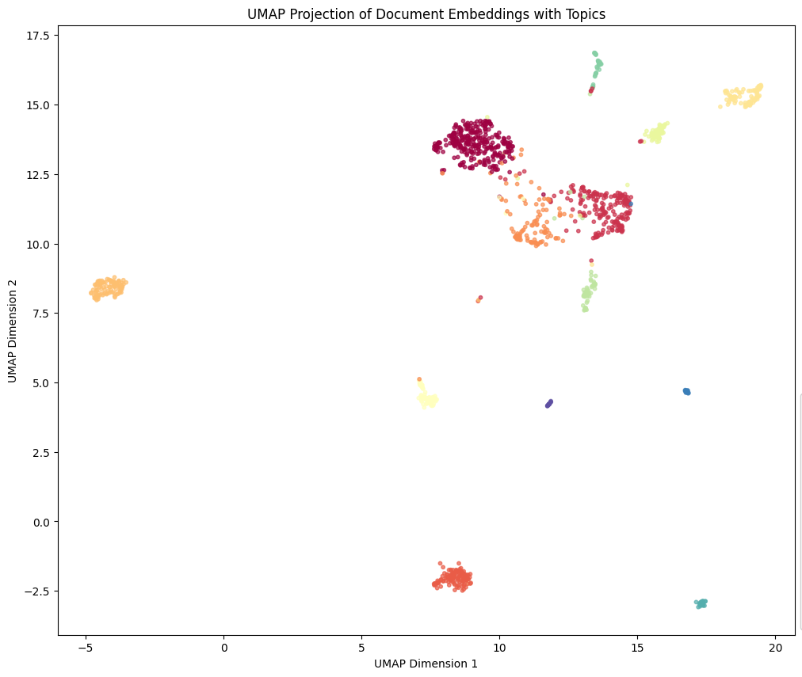

Naïve implementation of top2vec clustering using UMAP and HDBSCAN.

# Output


# install
```
$ for i in $(grep '^From ' caughtspam-20250601 | awk '{print $2}' | sort -u); do cat caughtspam-20250601 | grep "^From $i" > "$i.mbox"; done
$ cd ..
$ mkvenv
$ pip install -r requirements.txt
./run_top2vec.py documents/
...
--- Detected Topics and Top Words ---
Topic #0: Words: sbi, fri, may, from, wed
------------------------------
Topic #1: Words: rakuten, from, may, wed, fri
------------------------------
Topic #2: Words: amazon, com, wed, may, fri
------------------------------
Topic #3: Words: jcb, wed, may, fri, mail
------------------------------
Topic #4: Words: apple, may, from, wed, fri
------------------------------
Topic #5: Words: sbs, may, wed, from, documentos
------------------------------
Topic #6: Words: paypay, may, fri, mail, from
------------------------------
Topic #7: Words: matsui, fri, from, may, wed
------------------------------
Topic #8: Words: wed, may, fri, from, sun
------------------------------
Topic #9: Words: from, mail, may, fri, jcb
------------------------------
Topic #10: Words: fri, mon, mail, may, from
------------------------------
Topic #11: Words: fri, paypay, may, mail, from
------------------------------
Topic #12: Words: mail, wed, may, fri, from
------------------------------

```

For more, see [docs](docs).


